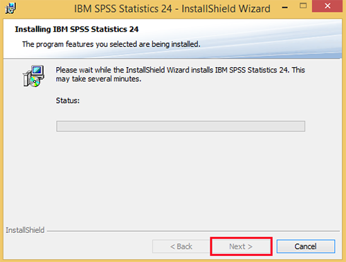
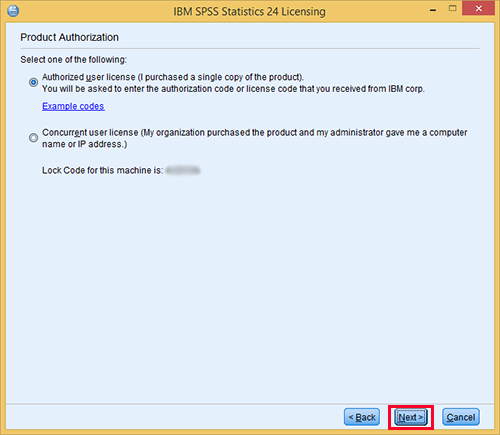

 

# Learning SPSS
Welcome on the  asynchoronous session for learning SPSS.
SPSS is a Software which is widely used as an Statistical Analytic Tool in the Field of Social Science, Such as Market research, Surveys, Competitor Analysis, and others. It is a comprehensive and flexible statistical analysis and data management tool.

----

## Installation Instructions
1.Install the IBM SPSS Statistics file you downloaded from [Software available at Campus](https://software.usc.edu/spss/).

2.The installer should begin running.!

 

3.On the IBM SPSS Statistics – InstallShield Wizard screen, click Next.

 

4.On the Software License Agreement screen, read the terms and choose I accept the terms in the license agreement, then click Next.

 

5.On the IBM SPSS Statistics – Essentials for Python screen, under Install IBM SPSS Statistics – Essentials for Python, select Yes and then click Next.

 

6.The following license agreement screen will appear. Select I accept the terms in the license agreement and then click Next to continue with the installation.

 

7.A second license agreement will appear. Choose I accept the terms in the license agreement and then click Next.

 

8.On the Destination Folder screen, click Next to install the software to its default location.

 

9.On the Ready to Install the Program screen, click Install.

 

10.SPSS will now install. This process takes approximately 2-5 minutes.

 

11.Once the installation has completed, click Finish on the InstallShield Wizard to end the installation process and launch IBM SPSS Statistics.

 

12.When you launch IBM SPSS Statistics for the first time, you will see the following screen and be asked to authorize your copy of SPSS. Click License Product to begin your authorization. NOTE: You must be connected to the Internet to successfully complete the authorization process.

 

13.The License Status screen will appear. Click Next to continue with the license process.

 

14.On the Product Authorization screen, choose Authorized user license (I purchased a single copy of the product). and then click Next.

 

15.On the Enter Codes screen, enter your authorization code. When you purchased your SPSS software from ITS, you should have received an email with this authorization code. Once you have entered the code, click Next to continue.

 

16.Once the authorization process is complete on the Internet Authorization Status screen, click Next.

 

17.On the Licensing Complete screen, click Finish to complete the installation.

 

NOTE: ITS suggests you open IBM SPSS Statistics once the installation has finished to ensure that the software has installed correctly.

----

## Importing Data from Excel into SPSS

### Access the practise Data Set

You will also need to download the dataset for the workshop by clicking [Here](https://github.com/DagaGargi/A-Step-by-Step-Guide-on-Learning-SPSS/raw/master/Spss_Import_Exampl.xlsx)

<iframe src="https://h5pstudio.ecampusontario.ca/h5p/41736/embed" width="993" height="584" frameborder="0" allowfullscreen="allowfullscreen"></iframe>

---

# Creating the Data Definitions: the variable view

<iframe src="https://h5pstudio.ecampusontario.ca/h5p/41749/embed" width="993" height="423" frameborder="0" allowfullscreen="allowfullscreen"></iframe>

## Testing your knowledge on Variables

**#Question 1**
<iframe src="https://h5pstudio.ecampusontario.ca/h5p/41718/embed" width="993" height="249" frameborder="0" allowfullscreen="allowfullscreen"></iframe>

**#Question 2**
<iframe src="https://h5pstudio.ecampusontario.ca/h5p/41719/embed" width="993" height="268" frameborder="0" allowfullscreen="allowfullscreen"></iframe>

**#Question 3**
<iframe src="https://h5pstudio.ecampusontario.ca/h5p/41722/embed" width="993" height="268" frameborder="0" allowfullscreen="allowfullscreen"></iframe>

**#Question 4**
<iframe src="https://h5pstudio.ecampusontario.ca/h5p/41723/embed" width="993" height="311" frameborder="0" allowfullscreen="allowfullscreen"></iframe>

----

# Statistical Analysis

**1.HISTOGRAM:** A histogram is a chart that shows frequencies for intervals of values of a metric variable.Such intervals as known as “bins” and they all have the same widths. 
*Note: There is a check your knowledge quiz at the end of the video. Enjoy your learning :joy:*

<iframe src="https://h5pstudio.ecampusontario.ca/h5p/41746/embed" width="993" height="620" frameborder="0" allowfullscreen="allowfullscreen"></iframe>

---

## Follow Up Material

To enhance your knowledge on SPSS for advanced analytics, multivariate analysis, business intelligence, criminal investigation, check out [SPSS Programming and Data Management: A Guide for SPSS and SAS Users](https://github.com/DagaGargi/A-Step-by-Step-Guide-on-Learning-SPSS/raw/master/SPSS%20Programming%20and%20Data%20Management%20A%20Guide%20for%20SPSS%20and%20SAS%20Users%20(Raynald%20Levesque%2C%20SPSS%20Inc.)%20(z-lib.org).pdf)

----
  
**This workshop is brought to you by the Brock University Digital Scholarship Lab.  For a listing of our upcoming workshops go to [Experience BU](https://experiencebu.brocku.ca/organization/dsl) if you are a Brock affiliate or [Eventbrite page](https://www.eventbrite.ca/o/brock-university-digital-scholarship-lab-21661627350) for external attendees.  For additional inquiries, contact [DSL@Brocku.ca](mailto:DSL@Brocku.ca)**

